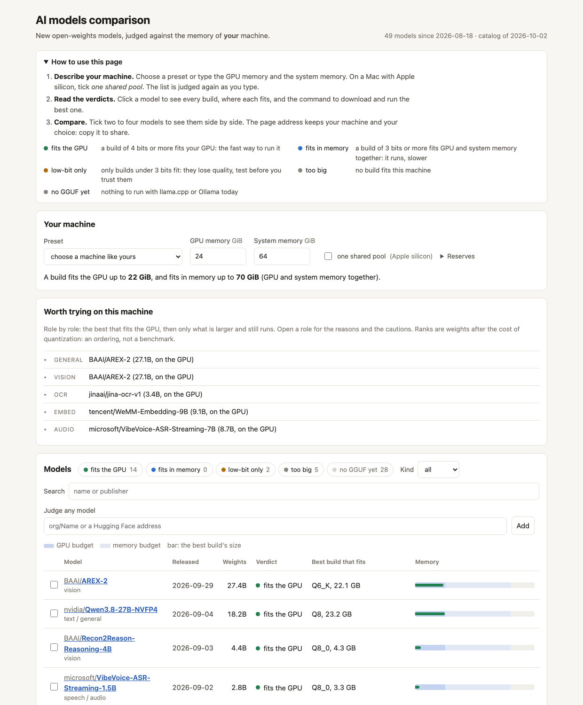
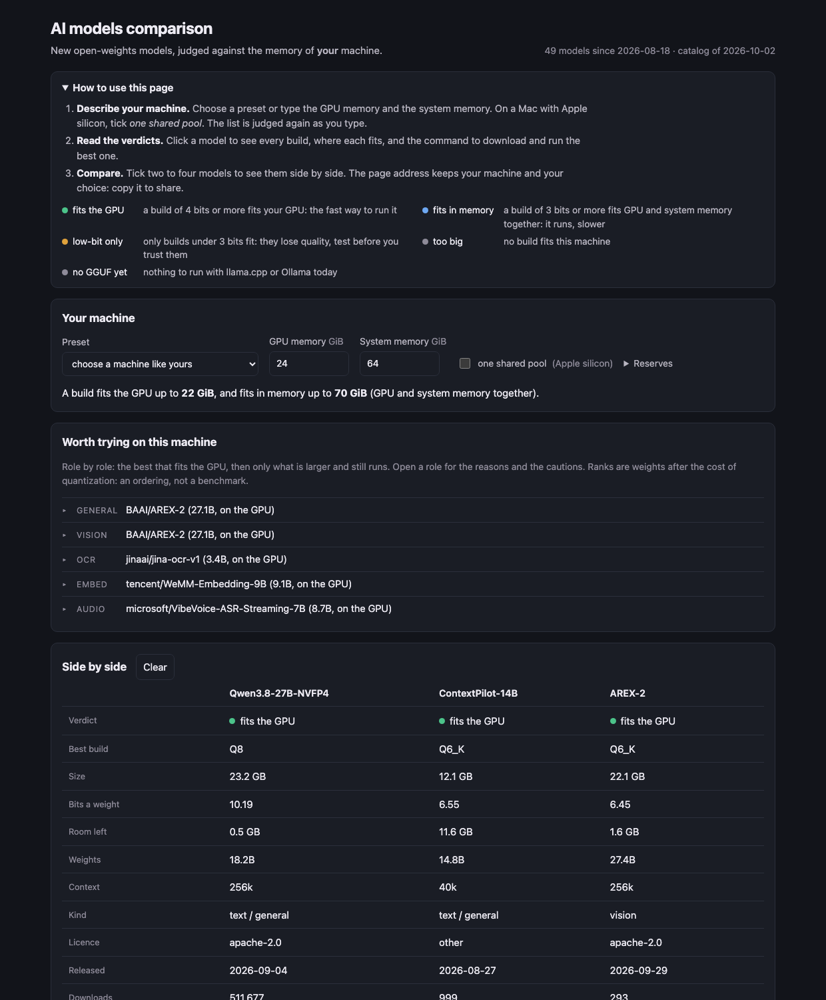

# ai-models-comparison

**New open-weights AI models, compared with the machine you have: which of them fit it, and which are worth trying?**

New models appear every week, each in a dozen builds from 3 GB to 400 GB. If you run models at home or on one
server, the question is always the same: *is there a build of this that fits my GPU, or at least my memory, and
is it a real build or a 1-bit one?* Answering by hand means opening the model page, finding a GGUF repository,
adding up shards and comparing with what the machine has.

`ai-models-comparison` does that for every new model of the publishers you watch, every day, and gives the
same answer four ways: a page in the browser, a command line, an HTTP API, and an MCP server for an agent.



## Try it in one minute

You need [uv](https://docs.astral.sh/uv/) (or pipx) and Python 3.11 or newer. Linux and macOS.

```bash
uvx --from git+https://github.com/YauhenBichel/ai-models-comparison ai-models-comparison serve --open
```

The page opens with your machine detected. Nothing is installed for good, nothing but JSON is downloaded, and
the GPU is not touched. To keep the command:

```bash
uv tool install git+https://github.com/YauhenBichel/ai-models-comparison
ai-models-comparison machine          # what this machine has
ai-models-comparison analyze          # what is worth trying here, role by role, with reasons
```

## What you can ask

| You want to know | Command | Guide |
|---|---|---|
| What does my machine have, and what fits it? | `ai-models-comparison machine` | [usage](docs/USAGE.md#1-your-machine) |
| Does this model fit? Which build? | `ai-models-comparison judge Qwen/Qwen3-Coder-Next` | [usage](docs/USAGE.md#2-does-this-model-fit) |
| These three models, side by side | `ai-models-comparison compare A B C` | [usage](docs/USAGE.md#3-compare-models-side-by-side) |
| What came out lately, and does it fit? | `ai-models-comparison new` | [usage](docs/USAGE.md#4-what-is-new) |
| What should I try on this machine? | `ai-models-comparison analyze` | [usage](docs/USAGE.md#5-what-is-worth-trying-the-analysis) |
| All of it in the browser | `ai-models-comparison serve --open` | [usage](docs/USAGE.md#6-the-page) |
| The same from my agent (Claude Code, Cursor, ...) | `ai-models-comparison mcp` | [integrations](docs/INTEGRATIONS.md#mcp-for-an-agent) |
| The same from my program | HTTP API, JSON, Python | [integrations](docs/INTEGRATIONS.md) |
| Tell me when a model that fits appears | a daily timer | [usage](docs/USAGE.md#7-a-daily-review-with-a-notification) |

Every command takes `--json`, and `--gpu-gb 24 --ram-gb 64` to ask about a machine you do not have yet.

**New here?** [docs/USAGE.md](docs/USAGE.md) is the step-by-step guide, and [docs/USE-CASES.md](docs/USE-CASES.md)
shows seven real questions answered on a home server: a bigger model than the one in use, which DeepSeek build,
what a memory upgrade would buy, a daily notification, a guarded download, an agent on a laptop asking about
the server.

## What it looks like

```console
$ ai-models-comparison compare nvidia/Qwen3.8-27B-NVFP4 tencent/ContextPilot-14B Qwen/Qwen3.8-Flash-Next --gpu-gb 24 --ram-gb 64
machine: 24 GiB GPU, 64 GiB system memory (given); fits the GPU up to 22.1 GiB of weights, fits in memory up to 70.1 GiB

               Qwen3.8-27B-NVFP4  ContextPilot-14B  Qwen3.8-Flash-Next
verdict        fits the GPU       fits the GPU      low-bit only
best build     Q8                 Q6_K              UD-IQ1_M
size           23.2 GB            12.1 GB           74.5 GB
bits a weight  10.19              6.55              3.31
room left      0.5 GB             11.6 GB           0.7 GB
weights        18.2B              14.8B             180B
context        256k               40k               256k
licence        apache-2.0         other             qwen-community-1.0
released       2026-09-04         2026-08-27        2026-08-24
```

In the page, click a model for every build and the command to run the best one; tick models to compare them.



## The verdicts

| Verdict | Means |
|---|---|
| **fits the GPU** | a build of at least 4 bits a weight fits the GPU budget: the fast way to run it |
| **fits in memory** | a build of at least 3 bits fits GPU and system memory together: it runs with part of the weights off the GPU (llama.cpp's `--n-gpu-layers` or `--n-cpu-moe`), slower |
| **low-bit only** | only builds under 3 bits fit. They lose quality: one published coding benchmark of a large model shows 3 bits nearly free and 1 bit costing 16 to 18 points. Measure before trusting |
| **too big** | no build fits; the report shows the smallest |
| **no GGUF yet** | nothing to run with llama.cpp or Ollama today |

**A verdict is about memory.** It does not say the model is good. The [analysis](docs/USAGE.md#5-what-is-worth-trying-the-analysis)
goes one step further: it compares the models that fit, role by role, and says which are worth a test and why.
It still does not run them. That is what your own tests are for.

## How it knows your machine

| Machine | Where the numbers come from | The budgets |
|---|---|---|
| NVIDIA GPUs | `nvidia-smi` (all cards summed), `/proc/meminfo` | GPU: its memory less 8 %; memory: that plus system memory less a quarter |
| AMD GPU, or an AMD APU with a BIOS carve-out | `/sys/class/drm/card*/device/mem_info_vram_total` | the same |
| AMD APU without a carve-out (the GPU maps system memory) | `mem_info_gtt_total` | one pool: system memory less a quarter |
| Apple silicon | `sysctl hw.memsize` | one pool: memory less a quarter |
| no GPU | `/proc/meminfo` | memory only: models run on the CPU |

Every figure can be set: `--gpu-gb`, `--ram-gb`, `--unified`, `--gpu-reserve-gb`, `--ram-reserve-gb`, or the
same keys in the configuration file (`ai-models-comparison config` prints an example). The reserves are what
you keep free for the context cache and the rest of the machine; the defaults are cautious.

## How it is built

One core, four thin interfaces. A **catalog** holds what does not depend on any machine (each model's builds
and sizes, weights, licence, context); building it is the slow part, so it is cached and can be published as
one JSON file. A **judge** is arithmetic on a catalog entry and two budgets, the same in Python and in the
browser. The command line, the HTTP API, the MCP server and the page only ask and print.
[docs/ARCHITECTURE.md](docs/ARCHITECTURE.md) has the design, what was investigated before it, and what it
deliberately leaves to other tools.

## Honest limits

- **Memory, not speed or quality.** No tokens per second, no benchmark scores. For a mixture-of-experts model,
  [moe-fit](https://github.com/YauhenBichel/moe-fit) plans the placement and estimates the speed. For a general
  "what fits my hardware" tool with a large built-in model list, see [llmfit](https://github.com/AlexsJones/llmfit);
  this tool's own job is the daily watch of **new** releases with real file sizes.
- **File size is not loaded size.** The context cache and the runtime take more; that is what the reserves
  are for. A model at the edge of a budget deserves a look at its card.
- **GGUF only.** Models that ship only as safetensors, MLX or ONNX show as "no GGUF yet".
- **Names are matched, not understood.** A build repository with an unusual name is missed. A role is a
  guess from the name and the task tag.
- **The analysis ranks by size after quantization.** It is an ordering with reasons, not a measurement.
- **Public repositories only**, and Hugging Face allows about 500 questions in five minutes without a token;
  answers are cached for six hours, and `HF_TOKEN` in the environment is used when present and never printed.

## Contributing

Issues and pull requests are welcome: a machine it detects wrongly (paste `ai-models-comparison machine --json`),
a model whose builds it misses, a publisher worth watching by default.

```bash
uv run ruff check . && uv run mypy && uv run pytest -q && node --test tests/judge.test.mjs     # no network, no GPU
```

## Licence

Apache-2.0.
