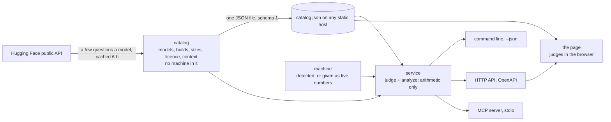

# Architecture

What was investigated before the design (2 October 2026), the design, and what is deliberately not built.

## What exists already, and what is left to do

| Tool | What it does | How it gets its data |
|---|---|---|
| [llmfit](https://github.com/AlexsJones/llmfit) (Rust, MIT, about 37,000 stars) | "what fits my hardware": terminal UI, command line, REST, MCP, a desktop app | a 14 MB list of models scraped from Hugging Face and **built into the binary**; a new model arrives with a new release of the tool. Memory is computed from the weight count, not from file sizes. Its open issues ask for fresher data |
| [gguf-parser-go](https://github.com/gpustack/gguf-parser-go) | reads a GGUF file's header remotely and estimates memory per device, to about 100 MiB by its own claim | range requests to the file |
| Hugging Face's hardware panel | per model page, against hardware saved in your account | not a feed, method undocumented |
| canirun-style sites | detect hardware in the browser, a curated list of some dozens of models | weight counts |
| LM Studio (`lms load --estimate-only`) | an estimate for a model you already chose | the local file |

"Does model X fit" is well served. **Nobody watches new releases daily and judges them against your machine
using the real sizes of the published builds.** That is this tool's job, and the design follows from it: the
data must be fresh without a new release of the tool, and it must be cheap for many people to read.

## The design in one picture

Three decisions carry it.

**1. A catalog that knows no machine, and a judge that knows no network.** Everything slow and rate-limited
(what a publisher released, which GGUF repositories exist, how large each build is) goes into the catalog.
Everything about *your* machine is a pure function: `judge(builds, budgets)`. Consequences:

- the catalog can be built once a day by anyone and published as one file; a thousand readers cost Hugging
  Face nothing more than one reader;
- the judge is small enough to exist twice, in Python and in the browser (`web/judge.js`), held together by
  `tests/golden.json`: 56 cases both must answer identically;
- a request names its machine, so a server is stateless and one instance answers for any machine.

**2. One service layer, thin interfaces.** `service.py` holds the answers; the command line, the HTTP API and
the MCP server parse a request, call it, and print. The JSON is the same through every door (`schema: 1`).
A feature is written once, and a test of the service covers all three.

**3. The standard library only.** No dependency to install, audit or keep in step: `uvx` runs it in a second,
and the HTTP server, the MCP server and the cache are a few hundred lines each. The price is that both eras
of the MCP protocol are written by hand (see below).

## The parts

| Module | Holds | Network |
|---|---|---|
| `machine.py` | detection (NVIDIA, AMD with or without a carve-out, Apple silicon, none); budgets; `resolve(spec)` | none |
| `hub.py` | questions to Hugging Face: new models of a publisher, the GGUF repositories of exactly a model, shards summed per quantization | yes |
| `cache.py` | answers kept six hours on disk; an old answer beats none when the hub is unreachable | none |
| `catalog.py` | `Entry`, `Catalog`, `build()` (a few models at a time), `load()` from a file or an address, the JSON Schema | through `hub` |
| `judge.py` | `judge(builds, budgets)` and the verdict words | none |
| `analyze.py` | the short list a role, with reasons and cautions | none |
| `service.py` | `machine`, `models`, `new`, `analyze`, `catalog`: the answers | through `catalog` |
| `cli.py`, `server.py`, `mcp.py`, `web/` | the four doors | none of their own |

## Scale

| Load | What carries it |
|---|---|
| one person, a few questions | the disk cache: the second question asks Hugging Face nothing |
| a team, one server | `serve`: stateless, a thread a request, a built catalog kept in memory for 30 minutes; a request brings its own machine |
| the public | no server at all: `site` writes the page and `catalog.json`; a static host or CDN serves them, and each browser judges for itself |

The limit that matters is Hugging Face's: about 500 API questions in five minutes without a token (seen in
its `ratelimit-policy` header). A catalog of 50 models costs about 170 questions cold and none warm. Conditional
requests do not save quota, so the cache is by time, not by ETag.

Known ways the static-catalog pattern fails, and the answers: stale data (the page shows the catalog's date
and warns after three days); a schema change breaking readers (`schema` in the file, a published JSON
Schema, additive changes only); a scheduled build silently stopping (GitHub disables schedules in a
repository with no activity for 60 days: the daily build is itself the activity, and the date on the page
shows a stop).

## The analysis

A verdict is binary; choosing among the models that fit is not. `analyze.py` ranks without running anything:

- **rank** = weights × what the build keeps of full precision, from one published benchmark by build
  (DeepSeek V3.1 on Aider Polyglot, unsloth's dynamic builds: 97 % at 4 bits, 95.5 % at 3, 92 % at 2, 78 % at 1);
- **kept**: the best on the GPU, then only what is larger and still runs (nothing both slower and smaller);
- **against the roster**: candidates smaller than what you run are dropped, except the best that is at least
  six months newer;
- **cautions**: licence, low-bit build, files a few days old, little room left for context.

It is deterministic and every line states its reason. It is an ordering, not a measurement: the weights of
two different families are not comparable in quality, and the tool says so in every output.

## MCP

The specification's revision 2026-07-28 removed the `initialize` handshake: every request carries its
version in `_meta`, results carry `resultType`, lists carry `ttlMs` and `cacheScope`, and a server must
answer `server/discover`. Clients of the earlier revisions still open with `initialize`. The server answers
both from one process, which is what the specification calls dual-era. Four tools, all with
`readOnlyHint`, an `outputSchema`, a short text and the full answer as structured content.

Only the stdio transport is implemented. The HTTP transport of the new revision has header rules of its
own; it is on the roadmap rather than half done.

## Security

- The server binds `127.0.0.1`, and refuses a request whose `Host` is not this machine: a page on another
  site cannot reach it through a name that points here.
- Listening on a network requires a token; the API then wants `Authorization: Bearer`.
- The page is served with a content security policy of `'self'`; model names from the hub are written as
  text, never as markup.
- Nothing is written outside the cache directory and the files a command names. No model is downloaded.
  `HF_TOKEN` is used when present and never printed or stored.

## Not built, on purpose

| Not built | Why | Instead |
|---|---|---|
| a built-in model database | it is what makes a fit tool stale | the catalog, built daily |
| speed estimates | they need the model's layout and the runtime | [moe-fit](https://github.com/YauhenBichel/moe-fit) for mixture-of-experts models |
| benchmark scores inside the verdict | most sources forbid redistribution; names do not join cleanly | roadmap: link out, and bundle only sources whose licence allows it |
| a hosted service | a static file scales further and costs nothing | `site` |

## Roadmap

1. **Publish**: PyPI (`pip install ai-models-comparison`), the MCP registry (`server.json`), a daily
   catalog and the page on GitHub Pages.
2. **Loaded size, not file size**: read each build's GGUF header once at catalog time (layers, heads,
   context) and add the context cache to the estimate, so "room left" is honest at long contexts.
3. **The analysis in the browser** too, with golden cases as for the judge.
4. **Quality data where the licence allows**: models.dev (MIT) and the LMArena leaderboard dataset
   (CC-BY-4.0) can be bundled with attribution; Artificial Analysis and LiveBench only linked.
5. **More machines**: several GPUs of different sizes, NPUs; MLX builds for Apple silicon.
6. **MCP over HTTP** in the 2026-07-28 form.

## Sources

Checked on 2 October 2026: the Hugging Face API (`gguf` on a model page, `ratelimit-policy`, CORS and ETag
headers); the MCP specification's 2026-07-28 changelog, versioning and discovery pages; llmfit's README,
API notes, data notes and issues; gguf-parser-go's README; Hugging Face's rate-limit and hardware
documentation; GitHub's documentation on scheduled workflows; unsloth's published Aider Polyglot results
by build. Other tools' claims are theirs.
