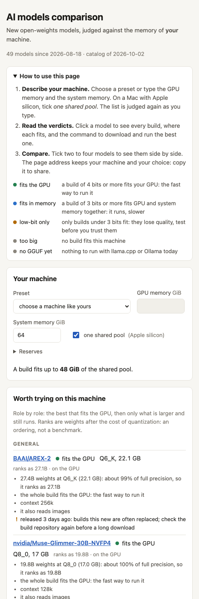

# How to use ai-models-comparison

Seven things you can do, each with the command, what comes back, and what to do with it. All examples are
real output. Start with the page if you prefer clicking, or with `machine` if you prefer a terminal.

**Install once** (Python 3.11 or newer, Linux or macOS):

```bash
uv tool install git+https://github.com/YauhenBichel/ai-models-comparison     # or: pipx install git+https://...
```

Or run without installing: put `uvx --from git+https://github.com/YauhenBichel/ai-models-comparison` before
any command below.

Two things hold for every command:

- `--gpu-gb 24 --ram-gb 64` asks about another machine (add `--unified` for one shared pool, as on Apple
  silicon). Without them, your own machine is detected.
- `--json` gives the answer as JSON, the same shape the HTTP API gives.

## 1. Your machine

```console
$ ai-models-comparison machine
system memory   64.0 GiB
GPU memory      24.0 GiB  (nvidia)
fits the GPU    up to 22.1 GiB of weights
fits in memory  up to 70.1 GiB of weights (GPU and system memory together)
reserves        GPU 1.9 GiB, system 16.0 GiB
```

The two "fits" lines are the budgets every verdict uses. The reserves are what stays free for the context
cache and the rest of the system. If they are wrong for you (a server that does nothing else can keep less),
set them: `--gpu-reserve-gb 1 --ram-reserve-gb 8`, or put them in the configuration file once (section 8).

## 2. Does this model fit?

Give a Hugging Face id, or paste the model page's address:

```console
$ ai-models-comparison judge Qwen/Qwen3.8-Flash-Next --gpu-gb 24 --ram-gb 64
machine: 24 GiB GPU, 64 GiB system memory (given); fits the GPU up to 22.1 GiB of weights, fits in memory up to 70.1 GiB
Qwen/Qwen3.8-Flash-Next (vision, 180B weights): low-bit only
      72.5 GB  UD-IQ1_S     memory
      74.5 GB  UD-IQ1_M     memory  <- low-bit only
      78.9 GB  UD-Q2_K_XL   no
      82.0 GB  UD-IQ3_XXS   no
      93.7 GB  UD-IQ4_XS    no
     ...
  get: hf download unsloth/Qwen3.8-Flash-Next-GGUF --include "*UD-IQ1_M*"
  run: llama-server -hf unsloth/Qwen3.8-Flash-Next-GGUF:UD-IQ1_M
  note: under 3 bits a weight: measure it on your own tasks before trusting it
```

How to read it: every build of the model, smallest first, and where it fits (`GPU`, `memory`, or `no`). The
arrow marks the build the tool would take. `get` downloads exactly that build; `run` starts it with llama.cpp.

A GGUF repository can be named directly (`judge unsloth/Qwen3.8-Flash-Next-GGUF`): its own files are judged.

**In a script**, `--require` turns the verdict into an exit status:

```bash
ai-models-comparison judge Qwen/Qwen3-Coder-Next --require gpu && echo "fits the GPU: download it"
# exit 0 the requirement is met, 3 it is not, 1 the model was not found, 2 the command line was wrong
```

## 3. Compare models side by side

```console
$ ai-models-comparison compare nvidia/Qwen3.8-27B-NVFP4 tencent/ContextPilot-14B Qwen/Qwen3.8-Flash-Next --gpu-gb 24 --ram-gb 64

               Qwen3.8-27B-NVFP4  ContextPilot-14B  Qwen3.8-Flash-Next
verdict        fits the GPU       fits the GPU      low-bit only
best build     Q8                 Q6_K              UD-IQ1_M
size           23.2 GB            12.1 GB           74.5 GB
bits a weight  10.19              6.55              3.31
room left      0.5 GB             11.6 GB           0.7 GB
weights        18.2B              14.8B             180B
context        256k               40k               256k
kind           text               text              vision
licence        apache-2.0         other             qwen-community-1.0
released       2026-09-04         2026-08-27        2026-08-24
downloads      511,677            999               1,299,909
```

What the rows tell you:

- **room left** is the budget minus the build. Under a few GB, a long context will not fit beside it.
- **bits a weight** is the build's real size divided by the weight count. Under 3, expect lost quality.
- **licence** `other` or a named community licence: read it before commercial use.

Up to twelve models in one question.

## 4. What is new?

```console
$ ai-models-comparison new --days 45
# Open-weights models since 2026-08-18, judged for this machine
| Model | Released | Kind | Weights | Verdict | Best build that fits | Role | Would replace | Note |
...
Counts: fits the GPU 14, low-bit only 2, too big 5, no GGUF yet 28.
```

About twenty publishers are watched by default (DeepSeek, Qwen, Google, Mistral, Meta, NVIDIA, Microsoft and
others). Narrow it: `--publisher Qwen --publisher google`, `--kind text`, `--since 2026-09-01`.
`--out DIR` writes the report as Markdown, `--html FILE` as one page.

## 5. What is worth trying: the analysis

A verdict says a model fits. The analysis compares the ones that fit, role by role (coder, general, vision,
ocr, embed, audio), and keeps a short list with reasons (`+`) and cautions (`!`):

```console
$ ai-models-comparison analyze --gpu-gb 24 --ram-gb 64
general
  BAAI/AREX-2 (27.1B, on the GPU)
  1. BAAI/AREX-2  fits the GPU  Q6_K 22.1 GB  ranks as 27.1B, on the GPU
     + 27.4B weights at Q6_K (22.1 GB): about 99% of full precision, so it ranks as 27.1B
     + the whole build fits the GPU: the fast way to run it
     + context 256k
     + it also reads images
     ! released 3 days ago: builds this new are often replaced; check the build repository again before a long download
     ! only 1.6 GB of room left: the context cache needs some, so use a short context or the next smaller build
     run: llama-server -hf mradermacher/AREX-2-i1-GGUF:Q6_K
```

How the list is made:

1. **Rank** = the weights times what the build keeps of full precision (97 % at 4 bits, 95.5 % at 3, 92 % at
   2, 78 % at 1, from one published benchmark of a large model). It orders candidates; it is not a score.
2. **Kept**: the best that fit the GPU, then only what is larger than them and still runs. A model that is
   both slower and smaller than another one is left out, and the last line of each role counts what was left
   out and why.
3. **Against what you run**: name your current models in the configuration file (section 8) and each
   candidate says how it compares: "1.5 times the size of X", "6 months newer than X". Candidates smaller
   than what you run are dropped, except the best one that is much newer.

`analyze MODEL MODEL ...` analyses the models you name instead of the new ones.

**The analysis does not run anything.** Treat its list as "test these first", then run your own tasks.

## 6. The page

```bash
ai-models-comparison serve --open        # http://localhost:8377/
```

1. **Your machine** is filled in from what was detected. Change the numbers or choose a preset to see another
   machine; the list is judged again as you type.
2. **Worth trying** shows one line a role; open a role for the reasons and cautions.
3. **Models**: the coloured chips switch verdicts on and off. Click a model for every build, a bar showing
   each build against your GPU and memory budgets, and the commands with a Copy button.
4. **Compare**: tick two to four models. A side-by-side table appears above the list.
5. **Judge any model**: paste an id or a model page address and press Add.
6. **Share**: the page address keeps the machine, the search and the comparison. Copy it.



The server listens on your machine only. To reach it from another device, give it a token:
`ai-models-comparison serve --host 0.0.0.0 --token "$(openssl rand -hex 16)"` and open
`http://that-machine:8377/#token=...` once.

## 7. A daily review with a notification

```bash
ai-models-comparison new --state ~/.local/state/ai-models-comparison.json --out ~/reports/models --quiet
```

With `--state`, a run remembers what it has seen. With `notify` in the configuration (an
[ntfy](https://ntfy.sh) topic address, or any endpoint that takes a POST), a model that **newly fits** is one
line on your phone. The first run fills the state and stays quiet. As a systemd timer:

```ini
# ~/.config/systemd/user/ai-models-comparison.service
[Service]
Type=oneshot
ExecStart=%h/.local/bin/ai-models-comparison new --state %h/.local/state/ai-models-comparison.json --out %h/reports/models --quiet

# ~/.config/systemd/user/ai-models-comparison.timer
[Timer]
OnCalendar=*-*-* 07:10
Persistent=true
[Install]
WantedBy=timers.target
```

`systemctl --user enable --now ai-models-comparison.timer` starts it.

## 8. The configuration file

```bash
mkdir -p ~/.config/ai-models-comparison
ai-models-comparison config > ~/.config/ai-models-comparison/config.toml      # every key is commented out: edit what you need
```

The keys that matter most:

```toml
gpu_reserve_gb = 2          # kept free on the GPU
ram_reserve_gb = 16         # kept free for the system
publishers = ["Qwen", "deepseek-ai", "google"]     # whose new models to watch

[roster]                    # what you run today, by role, as Hugging Face ids: the analysis compares with these
coder = "Qwen/Qwen3-Coder-Next"
general = "openai/gpt-oss-120b"
```

## When something is wrong

| You see | It means | Do |
|---|---|---|
| `Hugging Face has no such model, or it is private or gated` | the id is mistyped, or the model needs a login | check the id on huggingface.co; for a gated model set `HF_TOKEN` |
| `no GGUF builds found` | nobody has published a GGUF of exactly this name yet | try again in a day or two, or name the GGUF repository directly |
| the wrong GPU memory | detection read another device, or a shared pool | set `--gpu-gb` / `--ram-gb`, and please open an issue with `machine --json` |
| HTTP 429 from Hugging Face | more than about 500 questions in five minutes | wait five minutes; answers are cached for six hours; `HF_TOKEN` raises the limit |
| old answers | the cache | `--no-cache` asks again |
